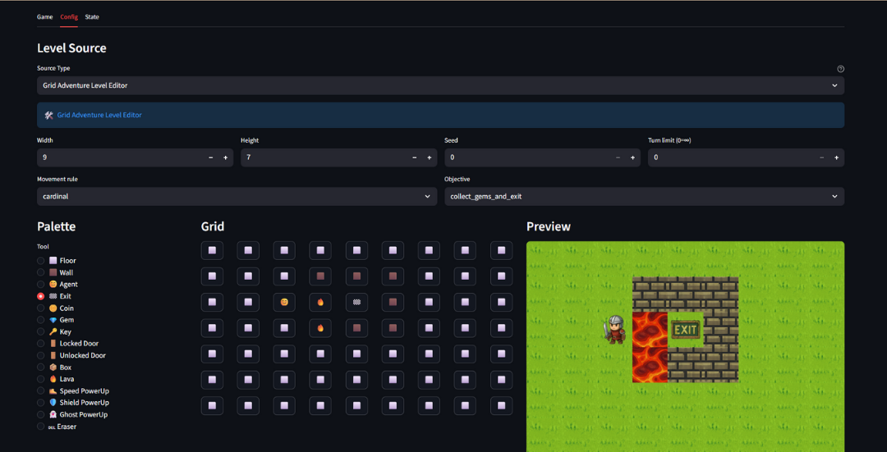
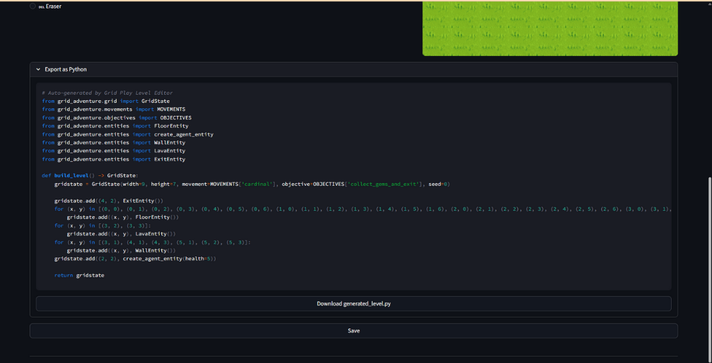

# Config Tab

The Config tab lets you select and configure a level before playing.

## Level sources

Grid Play provides two types of level sources:

- Intro Level Selector
- Level Editor

### Intro Level Selector

Pre-designed levels for learning the game mechanics.

| Source | Description |
|--------|-------------|
| **Gameplay Example** | 14 tutorial levels with progressive difficulty |

These levels introduce the core concepts step by step: movement, items, doors, and hazards. Select a level from the dropdown and click **Save** to play.

### Level Editor

Configurable levels for experimentation and testing.

| Feature | Usage |
|--------|-------------|
| **Level Config** | Set Width, Height, Seed, Time Limit, Movement Rule, Objective, and Agent Health to configure the level |
| **Entity Palette, Grid, and Preview** | Use the Entity Palette and grid to design the level |

| Feature | Usage |
|--------|-------------|
| **Level Exporter** | Generates a function that builds the level you designed |

When you are done, click **Save** to proceed to the [Game](game.md) tab and test your level.
