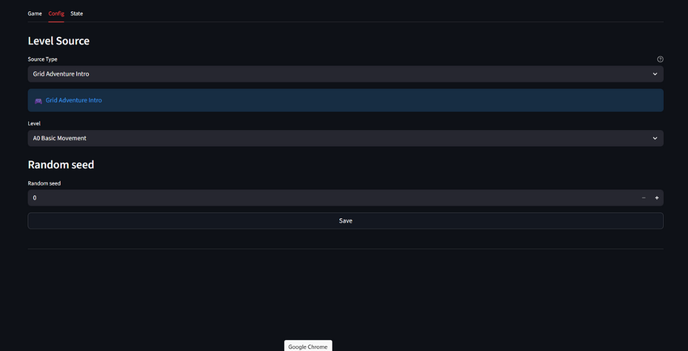

# Config Tab

The Config tab lets you select and configure a level before playing.

## Level sources

When launched with both Grid Adventure plugins, Grid Play provides two level sources:

- Grid Adventure Intro
- Grid Adventure Level Editor

### Grid Adventure Intro

Pre-designed levels for learning the game mechanics.

| Source | Description |
|--------|-------------|
| **Grid Adventure Intro** | 12 pre-built levels, A0 to A11 |

These levels introduce the core concepts step by step: movement, items, doors, and hazards. Select a level from the dropdown and click **Save** to play.

### Grid Adventure Level Editor

Configurable levels for experimentation and testing.

| Feature | Usage |
|--------|-------------|
| **Level Config** | Set Width, Height, Seed, Turn Limit, Movement Rule, and Objective. Select the Agent tool to set Agent Health |
| **Entity Palette, Grid, and Preview** | Use the Entity Palette and grid to design the level |
| **Level Exporter** | Displays a function that builds the level and lets you download it as `generated_level.py` |

When you are done, click **Save** to load or reset the level, then switch to the [Game](game.md) tab to test it.
