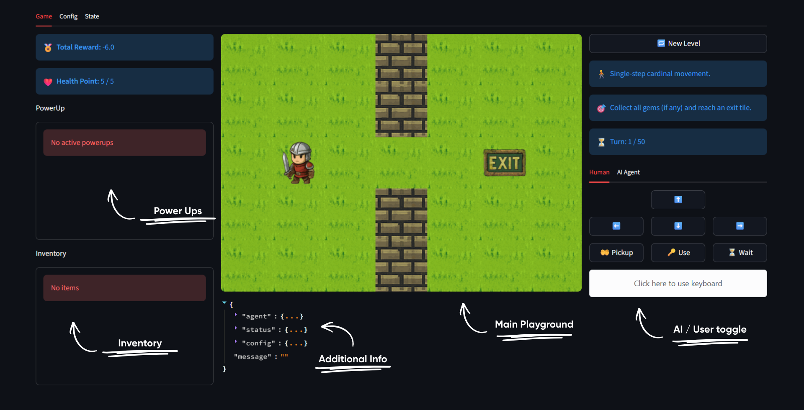
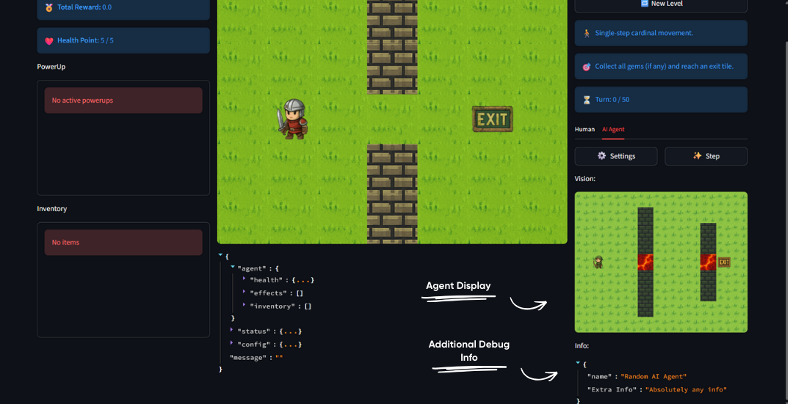

# Game Tab

The Game tab is where you play and interact with levels. It provides real-time visual feedback, player status, and multiple control options - including running your own agent.

## Interface layout

The tab is divided into three columns:

| Column | Purpose |
| -- | -- |
| Left | Player status |
| Middle | Game view (the current [observation](../agent/observations.md)) |
| Right | Level info and agent controls |

### Left column - Player status

Displays your current status:

| Indicator | Description |
|-----------|-------------|
| **Total Reward** | Your accumulated score / reward points |
| **Health Points** | Current HP, with damage notifications |
| **PowerUp Status** | Active temporary effects |
| **Inventory** | Items you have collected |

### Middle column - Game view

The central area shows:

- **Game visualization** - real-time rendering of the grid world
- **Observation info** - a JSON display of the current observation data

### Right column - Level info & controls

Provides context about the current level and how to control the agent:

| Section | Description |
|---------|-------------|
| **New Level** | Generate a new level variant |
| **Level Rules** | Movement type (e.g. cardinal directions) |
| **Objective** | What you need to do to win |
| **Turn Counter** | Remaining turns (if a turn limit exists) |
| **Agent Control** | Switch between Button, Keyboard, and Code control |

## AI Agent Mode

Choosing **Code** control lets you test your own [agent](../agent/agent-class.md).

### Loading an agent

1. Click the **Settings** button to open the agent dialog.
2. Paste your agent code, or use the provided template.
3. Click **Load** to compile and initialize the agent.

### Running the agent

- Click **Step** to execute one action from your agent.
- The **Vision** display shows what the agent "sees", using its [`parse`](../agent/agent-class.md#parse-parse-optional) method.
- The **Info** display shows debug information from your agent's [`info`](../agent/agent-class.md#info-info-optional) method.

